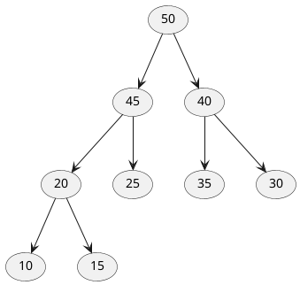

堆排序是一种利用堆特性的选择排序，复杂度为 O(nlog<sup>n</sup>)

堆是一颗完全二叉树

堆排序的基本思想是：将待排序序列构造成一个大顶堆，此时，整个序列的最大值就是堆顶的根节点。将其与末尾元素进行交换，此时末尾就为最大值。然后将剩余n-1个元素重新构造成一个堆，这样会得到n个元素的次小值。如此反复执行，便能得到一个有序序列了

将数组映射为二叉树结构，对应关系如下





(50) --> (45)
(50) --> (40)
(45) --> (20)
(45) --> (25)
(40) --> (35)
(40) --> (30)
(20) --> (10)
(20) --> (15)


|   #   |   0   |   1   |   2   |   3   |   4   |   5   |   6   |   7   |   8   |
| :---: | :---: | :---: | :---: | :---: | :---: | :---: | :---: | :---: | :---: |
|  arr  |  50   |  45   |  40   |  20   |  25   |  35   |  30   |  10   |  15   |

该数组从逻辑上讲就是一个堆结构，我们用简单的公式来描述一下堆的定义就是：

大顶堆：arr[i] >= arr[2i+1] && arr[i] >= arr[2i+2]  

小顶堆：arr[i] <= arr[2i+1] && arr[i] <= arr[2i+2]  

下标与节点位置关系：

* 下标为 i 的节点父节点下标： (i-1)/2 整数除法
* 下标为 i 的节点的左孩子下标：i*2 + 1
* 下标为 i 的节点的右孩子下标：i*2 + 2
* 最后一个非叶子节点位置：(数组长度/2) - 1

最后一点是怎么得到的？隐隐记得之前看过的那本数据结构数上貌似有类似的答案。。。

## 实现

```java
public class HeapSort {
    public static void main(String[] args) {
        int[] arr = new int[]{ 50, 45, 40, 20, 25, 35, 30, 10, 15 };
        System.out.println("Origin: " + Arrays.toString(arr));
        heapSort(arr);
        System.out.println("After:  " + Arrays.toString(arr));
    }

    private static void heapSort(int[] arr) {
        // 构建大顶堆, 即从最后一个非叶子节点开始对之前的节点分别做大顶堆调整
        for (int i = arr.length / 2 - 1; i > 0; i--) {
            heapify(arr, arr.length, i); // 起始点是最后一个节点，有时候我会写成 0
        }

        // 已经是大顶堆了，先交换，在调整，一直重复 n-1 次
        for (int i = arr.length - 1; i > 0; i--) {
            swap(arr, 0, i);
            heapify(arr, i, 0);
        }

    }

    private static void heapify(int[] arr, int length, int pos) {
        int largest = pos;
        int lson = pos * 2 + 1;
        int rson = pos * 2 + 2;

        // lson < length, 不包含相等的情况，不然数组越界了
        if (lson < length && arr[largest] < arr[lson]) {
            largest = lson;
        }

        if (rson < length && arr[largest] < arr[rson]) {
            largest = rson;
        }

        if (largest != pos) {
            swap(arr, largest, pos);
            heapify(arr, length, largest);
        }
    }

    private static void swap(int[] arr, int pos1, int pos2) {
        int tmp = arr[pos1];
        arr[pos1] = arr[pos2];
        arr[pos2] = tmp;
    }
}
```

## Refer

* [CNBLOG](https://www.cnblogs.com/chengxiao/p/6129630.html)
* [虽然是 C 实现，但是思路很清晰](https://www.bilibili.com/video/BV1fp4y1D7cj?from=search&seid=3873546409410814895)