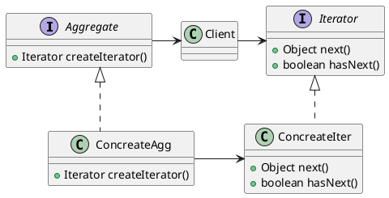

> **The Iterator Pattern** provides a way to access the elements of an aggregate object sequentially without exposing its underlying representation.
> 迭代器模式可以让我们在不需要知道一个集合的具体实现的情况下，依次访问集合中的各个元素

it also places the task of traveral(遍历) on the iterator object, not on the aggregate, which simplifies the aggregate interface and implementation, and places the responsibility where it should be.

> **Design Principle:** A class should have only one reason to change

## UML




@startuml
skinparam linetype ortho

Interface Aggregate {
	+Iterator createIterator()
}

Interface Iterator {
	+Object next()
    +boolean hasNext()
}

class ConcreateAgg implements Aggregate {
	+Iterator createIterator()
}

class ConcreateIter implements Iterator {
	+Object next()
    +boolean hasNext()
}

class Client

Aggregate -> Client
Client -> Iterator
ConcreateAgg -> ConcreateIter


ASCII 版本图示:

```txt
+------------------+                              +--------------------+                                                                             
|  <<interface>>   |         +-----------+        |   <<interface>>    |                                                                             
|    Aggregate     |<--------|  Client   |------> |      Iterator      |                                                                             
|------------------|         |           |        |--------------------|                                                                             
| createIterator() |         +-----------+        | hasNext()          |                                                                             
|                  |                              | next()             |                                                                             
+------------------+                              | remove()           |                                                                             
        ^                                         +--------------------+                                                                             
        |                                                     ^                                                                                      
        |                                                     |                                                                                      
        |                                                     |                                                                                      
        |                                                     |                                                                                      
+--------------------+                            +--------------------+                                                                             
| ConcreateAggregate |--------------------------->| ConcreateIterator  |                                                                             
|--------------------|                            |--------------------|                                                                             
| createIterator()   |                            | hasNext()          |                                                                             
|                    |                            | next()             |                                                                             
+--------------------+                            | remove()           |                                                                             
                                                  +--------------------+                                                                             
```

## 缘起

现在你是餐饮部的大老板了，上周你刚收购了两家餐厅，现在你要整合他们的业务，将他们的菜单合并以统一的用户体验，所幸，他们的底层菜品条目是一致的

```java
public class MenuItem {
    String name;
    String description;
    boolean vegetarian;
    double price;

    public MenuItem(String name, String description, boolean vegetarian, double price) {
        this.name = name;
        this.description = description;
        this.vegetarian = vegetarian;
        this.price = price;
    }

    // getter and setter
    @Override
    public String toString() {
        return name + ", desc:'" + description + '\'' +  ", vegetarian:" + vegetarian + ", price:" + price;
    }
}
```

两家店铺的菜单实现代码如下

```java
// 煎饼电，通过 List 来存储菜单
public class PancakeHouseMenu {
    ArrayList<MenuItem> menuItems;

    public PancakeHouseMenu() {
        menuItems = new ArrayList<>();
        addItem("K & B’s Pancake Breakfast", "Pancakes with scrambled eggs, and toast", true, 2.99);
        addItem("Regular Pancake Breakfast", "Pancakes with fried eggs, sausage", false, 2.99);
        addItem("Blueberry Pancakes", "Pancakes made with fresh blueberries", true, 3.49);
        addItem("Waffles", "Waffles, with your choice of blueberries or strawberries", true, 3.59);
    }

    public void addItem(String name, String description, boolean vegetarian, double price) {
        MenuItem menuItem = new MenuItem(name, description, vegetarian, price);
        menuItems.add(menuItem);
    }

    public ArrayList<MenuItem> getMenuItems() {
        return menuItems;
    }
}

// 小吃店，通过 Array 存储菜单
public class DinerMenu {
    final int MAX_ITEMS = 6;
    int numberOfItems = 0;
    MenuItem[] menuItems;

    public DinerMenu() {
        menuItems = new MenuItem[MAX_ITEMS];
        addItem("Vegetarian BLT", " (Fakin’)Bacon with lettuce & tomato on whole wheat", true, 2.99);
        addItem("BLT", "Bacon with lettuce & tomato on whole wheat", false, 2.99);
        addItem("Soup of the day", "Soup of the day, with a side of potato salad", false, 3.29);
        addItem("Hotdog", "A hot dog, with saurkraut, relish, onions, topped with cheese", false, 3.05);
        addItem("Steamed Veggies and Brown Rice", "Steamed vegetables over brown rice", false, 3.99);
        addItem("Pasta", "Spaghetti with Marinara Sauce, and a slice of sourdough bread", false, 3.89);
    }

    public void addItem(String name, String description, boolean vegetarian, double price) {
        MenuItem menuItem = new MenuItem(name, description, vegetarian, price);
        if (numberOfItems >= MAX_ITEMS) {
            System.err.println("Sorry, menu is full !Can’t add item to menu");
        } else {
            menuItems[numberOfItems] = menuItem;
            numberOfItems = numberOfItems + 1;
        }
    }

    public MenuItem[] getMenuItems() {
        return menuItems;
    }
}
```

在没有做重构的情况下，每当你想要打印所有的菜单，你就得用两个循环，分别 loop 一下这两家店的菜单, 并且更糟糕的是，下次你再收购店面，你就必须再改一次这部分代码

```java
public class LoopMenu {
    public static void main(String[] args) {
        MenuItem[] dinerMenu = new DinerMenu().getMenuItems();
        for (MenuItem menu : dinerMenu) {
            System.out.println(menu);
        }

        List<MenuItem> menuItemList = new PancakeHouseMenu().getMenuItems();
        for (MenuItem menuItem : menuItemList) {
            System.out.println(menuItem);
        }
    }
}
```

为了解决这个问题，我们新建一个 Iterator 接口来解决这个问题

```java
public interface Iterator {
    boolean hasNext();
    Object next();
}
```

为小吃店新建一个 Iterator 实现并在小吃点的菜单中添加返回 Iterator 的方法

```java
public class DinerMenuIterator implements Iterator {
    MenuItem[] items;
    int position = 0;

    public DinerMenuIterator(MenuItem[] items) {
        this.items = items;
    }

    @Override
    public boolean hasNext() {
        // position 这里不用做 +1 处理，拿长度为 1 的 arr 做例子。初始化后，调用 hasNext()，0 < 1 && obj != null 返回 true
        return position < items.length && items[position] != null;
    }

    @Override
    public Object next() {
        MenuItem item = items[position];
        position++;
        return item;
    }
}

public class DinerMenu {
    // duplicated before

    public Iterator createIterator() {
        return new DinerMenuIterator(menuItems);
    }
}
```

对煎饼摊做同样的操作

```java
public class PancakeHouseMenuIterator implements Iterator {
    List<MenuItem> menuItemList;
    int position = 0;

    public PancakeHouseMenuIterator(List<MenuItem> menuItemList) {
        this.menuItemList = menuItemList;
    }

    @Override
    public boolean hasNext() {
        return position < menuItemList.size();
    }

    @Override
    public Object next() {
        MenuItem item = menuItemList.get(position);
        position++;
        return item;
    }
}

public class PancakeHouseMenu {
    // duplicated before

    public Iterator createIterator() {
        return new PancakeHouseMenuIterator(menuItems);
    }
}
```

客户端的代码

```java
public class IteratorClient {
    public static void main(String[] args) {
        Iterator it1 = new PancakeHouseMenu().createIterator();
        Iterator it2 = new DinerMenu().createIterator();

        System.out.println("MENU\n----\nBREAKFAST");
        printMenu(it1);

        System.out.println("\nLUNCH");
        printMenu(it2);
    }

    private static void printMenu(Iterator it) {
        while (it.hasNext()) {
            System.out.println(it.next());
        }
    }
}

// MENU
// ----
// BREAKFAST
// K & B’s Pancake Breakfast, 2.99 -- Pancakes with scrambled eggs, and toast
// Regular Pancake Breakfast, 2.99 -- Pancakes with fried eggs, sausage
// Blueberry Pancakes, 3.49 -- Pancakes made with fresh blueberries
// Waffles, 3.59 -- Waffles, with your choice of blueberries or strawberries

// LUNCH
// Vegetarian BLT, 2.99 --  (Fakin’)Bacon with lettuce & tomato on whole wheat
// BLT, 2.99 -- Bacon with lettuce & tomato on whole wheat
// Soup of the day, 3.29 -- Soup of the day, with a side of potato salad
// Hotdog, 3.05 -- A hot dog, with saurkraut, relish, onions, topped with cheese
// Steamed Veggies and Brown Rice, 3.99 -- Steamed vegetables over brown rice
// Pasta, 3.89 -- Spaghetti with Marinara Sauce, and a slice of sourdough bread
```

其实 Java util 包下有自己的 Iterator 实现，集合类是这个设计模式的重度使用者，下面我们用官方实现替换我们自己的实现。

代码会更简单，除了在各 class 文件中引入的引用外，PancakeHouseMenuIterator 可以删除， 在 PancakeHouseMenu 的 createIterator() 直接返回 List.iterator() 即可。

为了让实现更精简，我们还可以抽象出一个 Menu 类作为基类

```java
public interface Menu {
    Iterator<MenuItem> createIterator();
}
```

然后两个 Menu 实体类实现这个接口

```java
public class DinerMenu implements Menu {
    //...
}
public class PancakeHouseMenu implements Menu{
    //...
}
```

客户端中通过 Menu 基类访问

```java
public class IteratorClient {
    public static void main(String[] args) {
        Menu menu1 = new PancakeHouseMenu();
        Menu menu2 = new DinerMenu();

        System.out.println("MENU\n----\nBREAKFAST");
        printMenu(menu1);

        System.out.println("\nLUNCH");
        printMenu(menu2);
    }

    private static void printMenu(Menu menu) {
        Iterator<MenuItem> it = menu.createIterator();
        while (it.hasNext()) {
            System.out.println(it.next());
        }
    }
}
```

这样最大的好处是，客户端只和接口做交互，不需要关心具体实现，这就是传说中的 面向接口编程

时隔半个月，你又收购了一家咖啡店，是时候测试一下你的策略是否好使了。咖啡店菜单如下

```java
public class CafeMenu {
    Hashtable menuItems = new Hashtable();

    public CafeMenu() {
        addItem("Veggie Burger and Air Fries", "Veggie burger on a whole wheat bun, lettuce, tomato, and fries", true, 3.99);
        addItem("Soup of the day", "A cup of the soup of the day, with a side salad", false, 3.69);
        addItem("Burrito", "A large burrito, with whole pinto beans, salsa, guacamole", true, 4.29);
    }

    public void addItem(String name, String description, boolean vegetarian, double price) {
        MenuItem menuItem = new MenuItem(name, description, vegetarian, price);
        menuItems.put(menuItem.getName(), menuItem);
    }

    public Hashtable getItems() {
        return menuItems;
    }
}
```

我们按照之前的重构方案，让他实现 Menu 接口并提对应的方法实现

```java
public class CafeMenu implements Menu{
    Hashtable<String, MenuItem> menuItems = new Hashtable<>();

    public CafeMenu() {
        addItem("Veggie Burger and Air Fries", "Veggie burger on a whole wheat bun, lettuce, tomato, and fries", true, 3.99);
        addItem("Soup of the day", "A cup of the soup of the day, with a side salad", false, 3.69);
        addItem("Burrito", "A large burrito, with whole pinto beans, salsa, guacamole", true, 4.29);
    }

    public void addItem(String name, String description, boolean vegetarian, double price) {
        MenuItem menuItem = new MenuItem(name, description, vegetarian, price);
        menuItems.put(menuItem.getName(), menuItem);
    }

    public Hashtable<String, MenuItem> getItems() {
        return menuItems;
    }

    @Override
    public Iterator<MenuItem> createIterator() {
        return menuItems.values().iterator();
    }
}
```

然后在 IteratorClient 中添加对应的调用

```java
public class IteratorClient {
    public static void main(String[] args) {
        Menu menu1 = new PancakeHouseMenu();
        Menu menu2 = new DinerMenu();
        Menu menu3 = new CafeMenu();

        System.out.println("MENU\n----\nBREAKFAST");
        printMenu(menu1);

        System.out.println("\nLUNCH");
        printMenu(menu2);

        System.out.println("\n DRINK");
        printMenu(menu3);
    }

    private static void printMenu(Menu menu) {
        Iterator<MenuItem> it = menu.createIterator();
        while (it.hasNext()) {
            System.out.println(it.next());
        }
    }
}

// MENU
// ----
// BREAKFAST
// K & B’s Pancake Breakfast, 2.99 -- Pancakes with scrambled eggs, and toast
// Regular Pancake Breakfast, 2.99 -- Pancakes with fried eggs, sausage
// Blueberry Pancakes, 3.49 -- Pancakes made with fresh blueberries
// Waffles, 3.59 -- Waffles, with your choice of blueberries or strawberries

// LUNCH
// Vegetarian BLT, 2.99 --  (Fakin’)Bacon with lettuce & tomato on whole wheat
// BLT, 2.99 -- Bacon with lettuce & tomato on whole wheat
// Soup of the day, 3.29 -- Soup of the day, with a side of potato salad
// Hotdog, 3.05 -- A hot dog, with saurkraut, relish, onions, topped with cheese
// Steamed Veggies and Brown Rice, 3.99 -- Steamed vegetables over brown rice
// Pasta, 3.89 -- Spaghetti with Marinara Sauce, and a slice of sourdough bread

//  DRINK
// Soup of the day, 3.69 -- A cup of the soup of the day, with a side salad
// Burrito, 4.29 -- A large burrito, with whole pinto beans, salsa, guacamole
```

一切和预期的一样 ╮(￣▽￣"")╭
