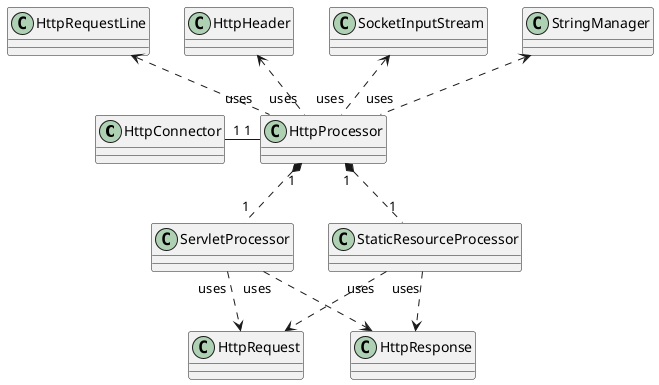

> **Chapter3** presents a simplified version of Tomcat 4's default connector.
> The application built in this chapter serves as a learning tool to understand the connector discussed in **Chapter4**

PS: 这个 project 有点老了，其中用到的 Catalina 包比较老, 找了半天

```xml
<dependency>
    <groupId>tomcat</groupId>
    <artifactId>catalina</artifactId>
    <version>4.0.4</version>
</dependency>
```

相比于 ex02 这章节实现的服务器多了如下功能

* connector parse request headers
* servlet can obtain headers, cookies parameter name/values, etc
* enhance response's getWriter

完成上述功能后，这个就是简化版的 Tomcat4 的 connector 了。Tomcat 的默认 connector 在 Tomcat4 时被 deprecated 了，不过还是有参考价值的。

开篇先介绍了一个用于做类似国际化的类 org.apache.catalina.util.StringManager. 原理很简单，就是这个类通过单例模式生成唯一对象，加载预先定义好的 properties，通过 getString 方法拿到对应语言的翻译。

相比之前的 project，这张开始，代码开始分包

```txt
.
├── ServletProcessor.java
├── StaticResourceProcessor.java
├── connector
│   ├── RequestStream.java
│   ├── ResponseStream.java
│   ├── ResponseWriter.java
│   └── http
│       ├── Constants.java
│       ├── HttpConnector.java
│       ├── HttpHeader.java
│       ├── HttpProcessor.java
│       ├── HttpRequest.java
│       ├── HttpRequestFacade.java
│       ├── HttpRequestLine.java
│       ├── HttpResponse.java
│       ├── HttpResponseFacade.java
│       ├── LocalStrings.properties
│       ├── LocalStrings_es.properties
│       ├── LocalStrings_ja.properties
│       └── SocketInputStream.java
└── startup
    └── Bootstrap.java
```

Bootstrap.java 为启动类，内容很简单，就是 new 一个 connector 然后执行 start 方法，让 connector 常驻。

connector 下的类可以分为五类

* connect 即该类的辅助类 HttpConnector + HttpProcessor
* 代表 Http Request 的类即其辅助类
* 代表 Http Response 的类即其辅助类
* Facade 类
* Constant 常量类

类关系图




HttpConnector "1"-"1" HttpProcessor

HttpProcessor "uses".up.> StringManager
HttpProcessor "uses".up.> SocketInputStream

HttpProcessor "uses".up.> HttpHeader
HttpProcessor "uses".up.> HttpRequestLine

HttpProcessor "1"*.down."1" ServletProcessor
HttpProcessor "1"*.down."1" StaticResourceProcessor

ServletProcessor "uses".down.> HttpRequest
ServletProcessor "uses".down.> HttpResponse
StaticResourceProcessor "uses".down.> HttpRequest
StaticResourceProcessor "uses".down.> HttpResponse


和 ex02 比，这里将 HttpServer 拆成了 HttpConnector 和 HttpProcessor 两个类。HttpConnector 等待 request， HttpProcessor 负责 request/response 的生成和处理。

为了提高 connector 的效率，设计的时候将 request 中的 parse 的行为经可能的延后了(比如有些 servlet 根本不需要 request 中的参数，这样 parse 就显得很多余，白白浪费了时间)。

TODO：connector 中的 SocketInputStream 有很方便的处理 request line 的方法，明天有机会可以测试一波

HttpProcessor 新建 request 并填充信息，比如 header 之类的，具体到 url 参数的解析，则由 request 类自己负责。

## 问题

> server 启动后访问 URL 抛异常 `Exception in thread "Thread-0" java.util.MissingResourceException: Can't find bundle for base name com.jzheng.connector.http.LocalStrings, locale en_US`

查看了一下编译后的 target 文件加，其中咩有 properties 文件，怀疑是一些类型的文件编译时没有同步过去，试着在 pom 中添加以前项目中用过的 build 代码，问题解决

```xml
<build>
    <plugins>
        <plugin>
            <groupId>org.apache.maven.plugins</groupId>
            <artifactId>maven-compiler-plugin</artifactId>
            <configuration>
                <source>1.8</source>
                <target>1.8</target>
            </configuration>
        </plugin>
    </plugins>
    <!-- 在 build 的时候将工程中的配置文件也一并 copy 到编译文件中，即 target 文件夹下 -->
    <resources>
        <resource>
            <directory>src/main/resources</directory>
            <includes>
                <include>**/*.properties</include>
                <include>**/*.xml</include>
            </includes>
        </resource>
        <resource>
            <directory>src/main/java</directory>
            <includes>
                <include>**/*.properties</include>
                <include>**/*.xml</include>
            </includes>
            <filtering>true</filtering>
        </resource>
    </resources>
</build>
```