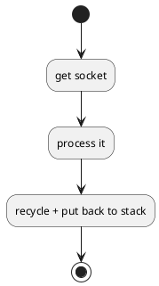

> **Chapter4** presents Tomcat 4's default connector. 
> This connector has been deprecated in favor of a faster connector called Coyote. Nevertheless, the default connector is simpler and easier to understand.

Tomcat 的 connector 是一个独立的模块，现存的比较有名的 connector 有 Coyote, mod_jk, mod_jk2 和 mod_webapp. Tomcat 需要 follow 的点有

* 必须实现 org.apache.catalina.Connector 接口
* 必须创建基于 org.apache.catalina.Request 接口的 request
* 必须创建基于 org.apache.catalina.Response 接口的 response

connector 会一直 stand by 等待 Http request 的到来，然后创建 request 和 response 对象，并通过调用 invoke 方法传送给 container。

```java
public void invoke(org.apache.catalina.Request request, org.apache.catalina.Response response);
```

默认的 tomcat connector 和 ex03 有点不同，它提供了 pool 机制来减小创建对象的开销，同时更多的使用 char arry 代替 string。

这节里面的多线程操作，值得好好看一看，之前一直都没有机会接触相关的知识点 (●°u°●)​ 」

## HTTP 1.1 New Features

### Persistent Connections

HTTP 1.1 相比于之前版本的协议在发送完所请求的资源之后，就把连接关闭了。但是一个页面可能包含其他很多资源，比如图片，音频之类的。如果这些资源下载都使用了不同的连接，那么整个过程会相当的慢。使用 persistent connection 之后，连接将被复用, 减小资源开销。

persistent connection 是 HTTP 1.1 的默认配置，你也可以通过 `connection: keep-alive` 属性显示的指定。

### Chunked Encoding

persistent connection 导致的一个结果是，发送方必须在发送 request 或 response 时指定自己发送的内容的长度。但是通常情况下服务器端并不能做到这一点。比如 servlet 会在一些数据准备好后就发送，并不会等到所有数据都完备再开始。

HTTP 1.0 的时候并不需要指定这个长度属性，连接会一直保持知道接收到 -1 这个结束标志符。HTTP 1.1 通过 transfer-encoding 这个标志位表示将要发送的流长度。每个 chunk 数据发送前都会先发送一个 16 进制长度 + CR/LF 的标志位。

### Use of the 100(Continue) Status

当客户端发送的 request body 很大时，他会在 header 中包含 100-continue 属性来和服务器端确认是否接收来提高效率，避免资源浪费(传到一半被拒绝)。服务器如果接收这种 request， 则返回 `HTTP/1.1 100 Continue`

## The Connector interface

Tomcat connector 必须实现 org.apache.catalina.Connector 接口，主要方法有

* getContainer
* setContainer
* createReqeust
* createResponse


Interface Request
Interface Response

Request <.."instantiates" Connector
Request <.."uses" Container
Response <.."instantiates" Connector
Response <.."uses" Container


Interface Connector
Connector <|.. HttpConnector

Interface Container
Container <|.. SimpleContainer

Connector "1"->"1" Container

HttpConnector "1"--"*" HttpProcessor

HttpProcessor "uses".d.> HttpHeader
HttpProcessor "uses".d.> RequestLine
HttpProcessor "uses".d.> SocketInputStream
HttpProcessor "uses".d.> StringManager


重点：Connector 和 Container 是 1 对 1 的关系，Connector 和 Processor 是 1 对多的关系

## The HttpConnector Class


Interface Connector
Interface Lifecycle
Interface Runnable

Connector <|.. HttpConnector
Lifecycle <|.. HttpConnector
Runnable <|.. HttpConnector


Lifecycle 接口用于管理每一个 catalina component 的生命周期，具体内容第六章介绍

### Creating a Server Socket

通过工厂方法拿到 ServerSocket, 参见 ServerSocketFactory 和对应的实现 DefaultServerSocketFactory

### Maintaining HttpProcess Instances

HttpContainer 中声明了一个 stack 类型的变量存储 processor 的实例，实现类似 pool 的效果。在 start() 方法被调用的时候，会更具设定的 pool 大小预先创建一些 processor 已供使用

```java
private Stack processors = new Stack();
// ...
// Create the specified minimum number of processors
while (curProcessors < minProcessors) {
    if ((maxProcessors > 0) && (curProcessors >= maxProcessors))
        break;
    HttpProcessor processor = newProcessor();
    recycle(processor);
}
// ...
void recycle(HttpProcessor processor) {
    processors.push(processor);
}
```

PS: 句文档描述，应该是先创建 minProcessors 数量的 processor 然后接收 request 的时候动态扩容，最终达到最大，但是我看不到对应的逻辑，可能是在 thread 那块漏了什么

PPS: 这部分内容在 createProcessor() 方法中实现的

### Serving HTTP Requests

在 HttpConnector 的 run() 方法中体现出来，这个应该是实现的 Runabble 的接口，流程如下


(*) --> "accept socket"
if "create processor" then
--> [not null] "processor assign socket"
--> (*)
else
--> "log + close socket"
--> (*)
endif


createProcessor 工作流程

1. 如果 stack 中有，则返回
2. 如果没有，判断是否达到上限，没有就创建
3. 达到上限，返回并关闭 socket
4. 上限为 -1，创建 processor

processor 执行 assign 之后立即结束，后续工作由 processor 在单独的现成中完成

## The HttpProcessor Class

和 HttpConnector 类似 HttpProcessor 也实现了 Runnable 和 Lifecycle 接口


Interface Lifecycle
Interface Runnable

Lifecycle <|.. HttpProcessor
Runnable <|.. HttpProcessor


这里主要探究 processor 的 assign 方法是如何使用多线程来支持 tomcat 同时处理多个 request 的功能的

> For each HttpProcessor instance the HttpConnector creates, its start method is called, effectively starting the "processor thread" of the HttpProcessor instance.

HttpProcessor 被创建的时候， start 方法被调用，然后 process 线程就被执行了？貌似是这个意思，多线程这块还是弱了一点，后面仔细了解一下



await 卡住，并等待获取 socket，如果没有获取一直空转。assign 方法通过 available flag 和 Object 自带的 wait(), notifyAll() 方法控制 await 的调用

PS: wait() 方法是当前线程保持等待一直到另一个线程调用 notify() 或者 notifyAll() 方法

服务器启动时 processor 的 await() 被调用并一直等待，知道 connector 调用 notifyAll() 方法唤醒它

当 connector 的 assign 方法被调用时，available 为 false，跳过 while，置位 available 并唤醒 processor

这里还穿插了 local variable(socket) 和 notifyAll() 的思考，反正我是不怎么理解。。。

## Request Objects / Request Objects

使用的是 catalina 自己定义的接口

## Process Requests

预先设置了一些 flag, 如 ok，finishResponse，stopped， keepAlive 等控制解析流程。主要就做了几件事

* parseConnection - 获取地址并塞到 request 中
* parseRequest - 同上节
* parseHeader - 解析 header 并塞到 request 中
* recycle response + request - 复用对象，相比于上一节完善了很多

## The Simple Container Application

这里的 container 是一个简易版本，实现了 catalina 中的 Container 接口以配合 connector 使用。只实现了 invoke 接口，里面的功能是加载 servlet class 并执行
