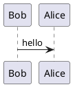

本地使用 VSCode 作为文本编辑器，集成 Hexo 和 PlantUML 在写博客的时候可以插入 UML 图。

## 安装插件

1. 安装插件 `npm install hexo-tag-plantuml --save`, [插件 git 地址](https://github.com/two/hexo-tag-plantuml)
2. `_config.yml` 中添加配置

```yml
tag_plantuml:
	type: static
```

UML 测试


    Bob->Alice : hello


提交到 remote repo, 等 hexo deploy 之后可以看到 UML 图

## VSCode 中显示 UML

上面的方式虽然远端可以显示了，但是本地查看的时候并不方便。VSCode 有提供插件可以在编辑器中显示对应的 UML

### 默认官方服务器生成 UML

打开 VSCode, 在插件列表中搜索 PlantUML 并安装即可，使用 `@startuml` 和 `@enduml` 包裹 UML 代码



点开 preview mode 可以看到 UML 成功生成

### 使用 local server 显示 UML

默认情况下插件使用官方服务器生成 UML，优点是方便，缺点是要联网，可能生存有延时。我们可以配置 local server 提供这个服务。已经有现成的 docker 镜像了，配置简单

1. 启动 container: `docker run -d -p 8080:8080 plantuml/plantuml-server:jetty` 或者 `docker run -d -p 8080:8080 plantuml/plantuml-server:tomcat` 效果一样，只是用了不同类型的服务器实现
2. 我本地有其他服务占用了 8080, 修改端口映射 `-p 7999:8080`
3. 访问 `http://localhost:7999` 查看服务是否启动
4. 修改 VSCode 中 PlantUML 插件配置

* cmd+shift+p 搜索 open user setting
* 关键子搜索 plantuml
* Plantuml:render 设置下选择 local
* Plantuml:server 输入本地 server 地址 `http://localhost:7999`

截图如下


点击 preview 之前的 UML 正常显示，设置完成

* [PlantUML docker 版 git 地址](https://github.com/plantuml/plantuml-server)